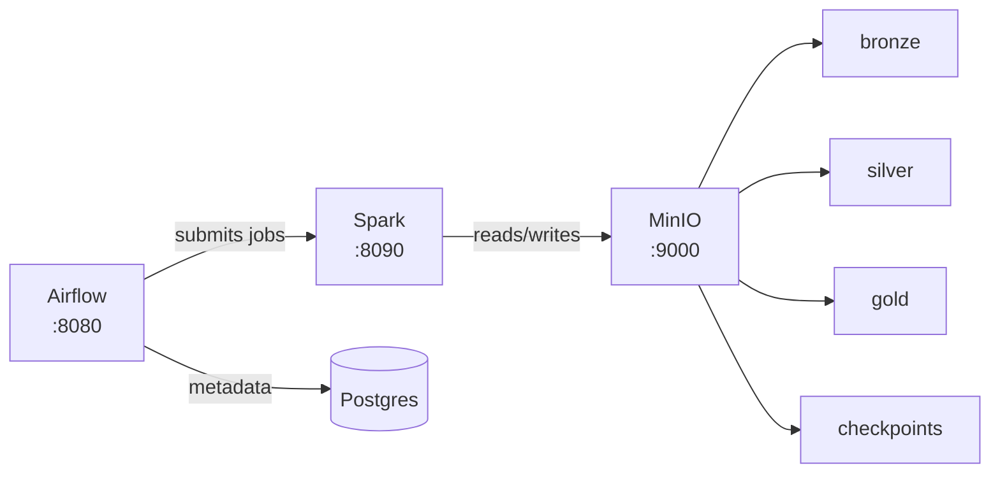
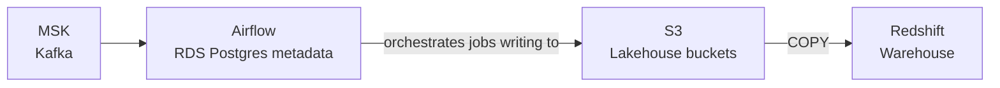

# data-platform-iac

[](https://github.com/vnugny/data-platform-iac/actions/workflows/ci.yml)

Infrastructure-as-Code for the data platform. Provisions a full local dev environment with Docker Compose and a production-grade cloud stack on AWS with Terraform.

## Architecture

### Local Dev (Docker Compose)



### Cloud (AWS Terraform)

The Terraform modules provision exactly these resources — Kafka (MSK), the Airflow
metadata database (RDS Postgres), the lakehouse object store (S3), and the warehouse
(Redshift). Spark compute is expected to run on the cluster of your choice and is not
provisioned by a module here.



## Quick Start (local)

**Prerequisites:** Docker Desktop, Make

```bash
# Clone
git clone https://github.com/vnugny/data-platform-iac.git
cd data-platform-iac

# Start everything
make up

# Or use the script
./scripts/start.sh
```

| Service     | URL                         | Credentials              |
|-------------|-----------------------------|--------------------------|
| Airflow     | http://localhost:8080       | admin / admin            |
| Spark UI    | http://localhost:8090       | —                        |
| MinIO       | http://localhost:9001       | minioadmin / minioadmin  |

```bash
make logs    # tail all logs
make down    # stop
make clean   # stop + remove volumes
```

## Terraform (cloud)

```bash
# Initialise
make tf-init ENV=dev

# Preview changes
make tf-plan ENV=dev

# Apply
make tf-apply ENV=dev
```

Copy `terraform/environments/dev/terraform.tfvars.example` to `terraform.tfvars` and fill in your values before applying.

## Repository Layout

```
├── docker/
│   ├── docker-compose.yml       # Local stack
│   ├── airflow/                 # Airflow image + requirements
│   └── spark/                   # Spark image + defaults
├── terraform/
│   ├── modules/
│   │   ├── kafka/               # AWS MSK
│   │   ├── airflow/             # RDS metadata DB + IAM
│   │   ├── warehouse/           # Redshift
│   │   └── minio/               # S3 buckets
│   └── environments/
│       └── dev/                 # Dev environment root module
├── scripts/
│   ├── start.sh
│   └── stop.sh
├── docs/decisions/              # Architecture Decision Records
└── Makefile
```

## Design Decisions

See [docs/decisions/](docs/decisions/) for ADRs.

## CI

GitHub Actions validates and lints the definitions on every push and PR — it does not
provision cloud resources or boot the full stack (see
[ADR 002](docs/decisions/002-ci-validates-not-provisions.md)):
- Terraform `fmt -check` + `validate` (against the dev environment, `-backend=false`)
- `hadolint` on the Airflow and Spark Dockerfiles
- `docker compose config` to validate the Compose file

Building the images and booting the stack stays a local activity (`make up`), and cloud
provisioning stays a deliberate `terraform apply`.
