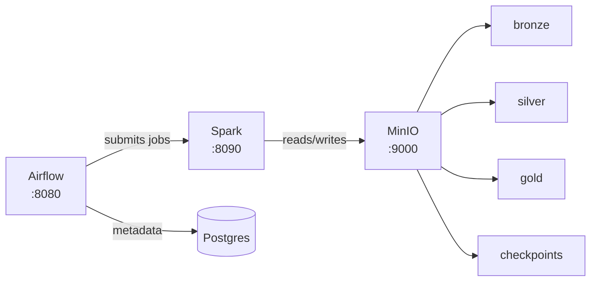
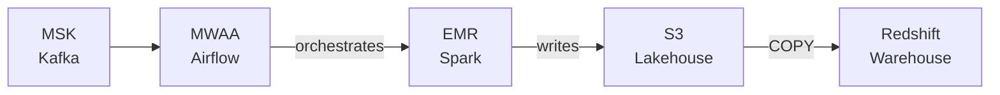

# data-platform-iac

Infrastructure-as-Code for the data platform. Provisions a full local dev environment with Docker Compose and a production-grade cloud stack on AWS with Terraform.

## Architecture

### Local Dev (Docker Compose)



### Cloud (AWS Terraform)



## Quick Start (local)

**Prerequisites:** Docker Desktop, Make

```bash
# Clone
git clone https://github.com/vnugny/data-platform-iac.git
cd data-platform-iac

# Start everything
make up

# Or use the script
./scripts/start.sh
```

| Service     | URL                         | Credentials              |
|-------------|-----------------------------|--------------------------|
| Airflow     | http://localhost:8080       | admin / admin            |
| Spark UI    | http://localhost:8090       | —                        |
| MinIO       | http://localhost:9001       | minioadmin / minioadmin  |

```bash
make logs    # tail all logs
make down    # stop
make clean   # stop + remove volumes
```

## Terraform (cloud)

```bash
# Initialise
make tf-init ENV=dev

# Preview changes
make tf-plan ENV=dev

# Apply
make tf-apply ENV=dev
```

Copy `terraform/environments/dev/terraform.tfvars.example` to `terraform.tfvars` and fill in your values before applying.

## Repository Layout

```
├── docker/
│   ├── docker-compose.yml       # Local stack
│   ├── airflow/                 # Airflow image + requirements
│   └── spark/                   # Spark image + defaults
├── terraform/
│   ├── modules/
│   │   ├── kafka/               # AWS MSK
│   │   ├── airflow/             # RDS metadata DB + IAM
│   │   ├── warehouse/           # Redshift
│   │   └── minio/               # S3 buckets
│   └── environments/
│       └── dev/                 # Dev environment root module
├── scripts/
│   ├── start.sh
│   └── stop.sh
├── docs/decisions/              # Architecture Decision Records
└── Makefile
```

## Design Decisions

See [docs/decisions/](docs/decisions/) for ADRs.

## CI

GitHub Actions runs on every PR:
- Terraform `fmt` + `validate`
- Docker image builds (cached)
- Compose smoke test (MinIO + Postgres health checks)
